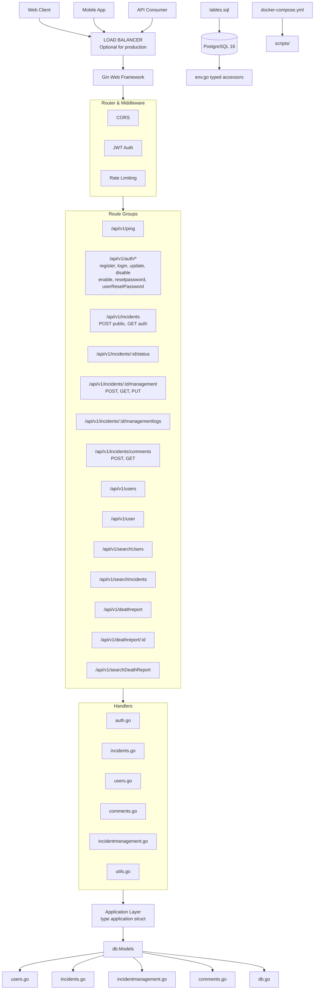
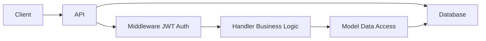
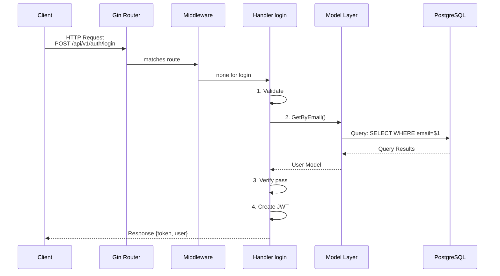
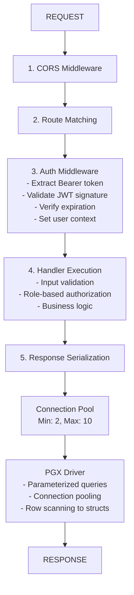
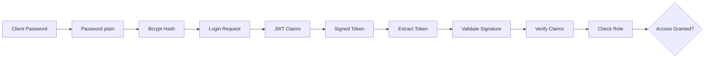
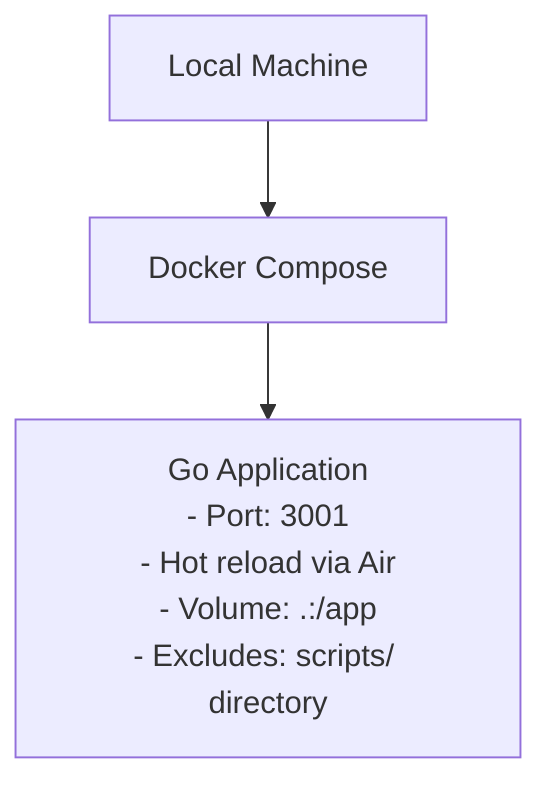
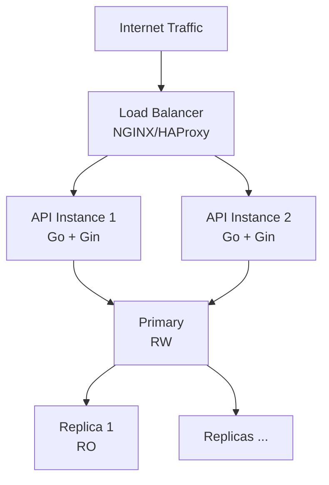

# Issue Tracker - System Design

**Code Metrics:** 3646 lines of Go, 28 source files

## System Overview

The Issue Tracker is a stateless RESTful API built with Go that provides incident tracking capabilities with role-based access control. The system follows a layered architecture pattern with clear separation between presentation, application, and data layers.

Go version: 1.26+

## Architecture Diagram

## Component Interaction Flow

## Data Flow Sequence

## Request-Response Flow

## System Components

### 1. Presentation Layer (`cmd/`)
- **Routes**: HTTP endpoint definitions with middleware chains
- **Handlers**: Request processing and response formatting
- **Types**: Request/response DTOs and domain types

### 2. Application Layer
- **Business Logic**: Implemented in handlers
- **Authorization**: Role-based access control
- **Validation**: Input validation using Gin binding

### 3. Data Access Layer (`internal/db/`)
- **Models**: Database interaction logic
- **Connection Pool**: PGX connection management
- **Queries**: Parameterized SQL operations

### 4. Infrastructure Layer
- **Database**: PostgreSQL with connection pooling
- **Configuration**: Environment variables
- **Deployment**: Docker Compose (PostgreSQL + Server containers)
- **Scripts**:
  - `login.sh` → Access DB shell
  - `commit.sh` → Git helper

## Security Architecture

## Role Hierarchy

| Role | Permissions |
|------|-------------|
| **superadmin** | User management (register, update, disable/enable, reset password, get user), report incidents, view all incidents, update any incident status, add comments, view comments, submit and update incident management reports, view incident management reports and logs |
| **admin** | Report incidents, view all incidents, update any incident status, add comments, view comments, submit and update incident management reports, view incident management reports and logs |
| **supervisor** | Report incidents, view own department incidents (via `incident_ward_dept`) |
| **manager** | Report incidents, view all incidents, view incident management reports and logs, add comments, view comments, submit incident management reports, update incident management reports |
| **reporter** | Report incidents via public endpoint only, view own department incidents |

## Deployment Architecture

### Development

### Production

## Performance Characteristics

| Metric | Value |
|--------|-------|
| Max Connections | 10 |
| JWT Expiration | 72 hours |
| Request Timeout | 1s read, 5s write |
| Idle Timeout | 30s |
| Pagination Limit | Max 50 items |

## Current Implementation Status

**Implemented:**
- ✅ Clean layered architecture (presentation → application → data → infrastructure)
- ✅ JWT authentication with 72-hour expiry
- ✅ Role-based access control (superadmin, admin, supervisor, manager, reporter)
- ✅ Department-scoped incident access
- ✅ Incident management follow-up reports
- ✅ Incident comments
- ✅ Structured logging (`internal/logger`)
- ✅ Health check endpoint (`/api/v1/ping`)
- ✅ CORS configuration
- ✅ Database connection pooling
- ✅ Docker Compose setup
- ✅ Unit tests for routes and handlers

**Pending:**
- ❌ Unit tests (increase coverage beyond current partial implementation)
- ❌ Rate limiting
- ❌ Error handling package
- ❌ Configuration validation

## Scalability Considerations

1. **Horizontal Scaling**: API instances can be scaled behind a load balancer
2. **Database Scaling**: Connection pooling, read replicas for reporting
3. **Caching**: Redis layer can be added for frequently accessed data
4. **Stateless**: JWT enables horizontal scaling without session storage